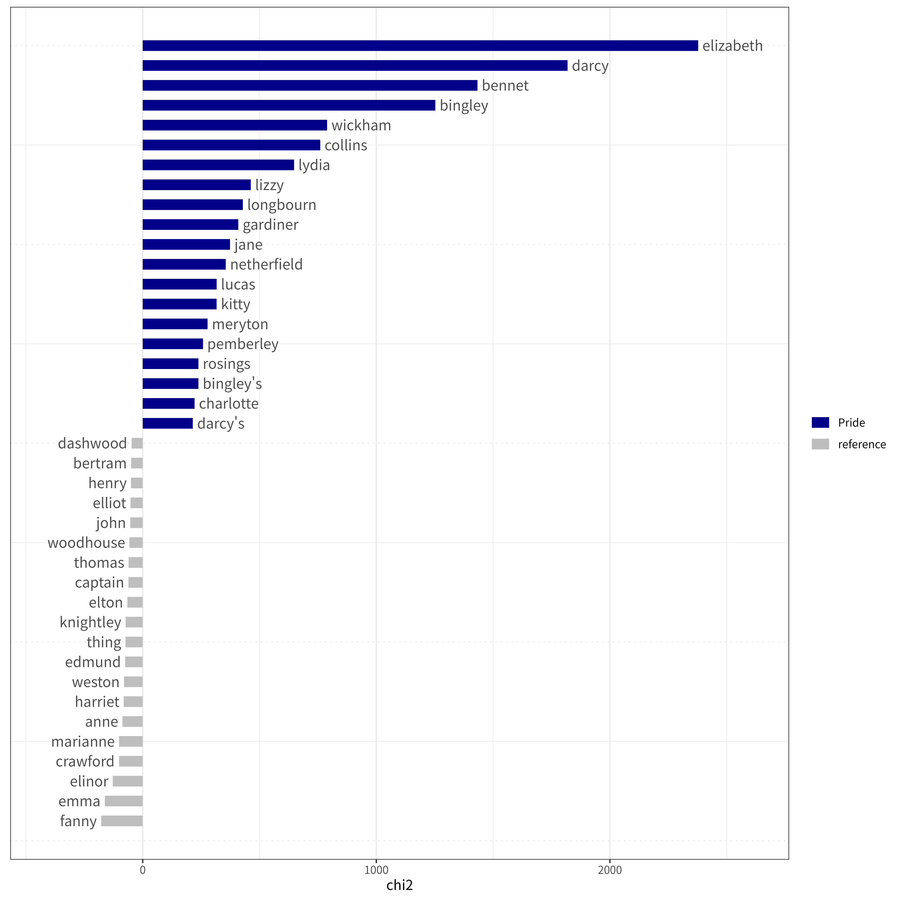

# AustenGPT
 
This project repurposes the small but versatile
[NanoGPT](https://github.com/karpathy/nanoGPT) for training Jane Austen’s published works in the early 19th century. It is made to accompany a research paper in progress on Jane Austen (1775-1817) and AI distant writing. We also use this opportunity to celebrate Austen’s 250th anniversary of her natal year in 1775. Happy birthyear, Jane! 


- Source: A high-resolution image can be found from [NPG](https://www.npg.org.uk/collections/search/portrait/mw00230/Jane-Austen "NPG link")

The repo hosts the code showing steps for building the two Austen corpuses, one for basic exploratory quantitative text analysis and other for AI traning. Here are the two corpuses specifically built for this project.

- QTA: `/data/austen_qta/austen_qta.csv`
- AI training: `/data/austen-char/austen-sans-quotes.txt`

We have tried our best to show how we achieve our results to allow fellow researcher to experiment with the corpuses, replicate and critique research findings. More details will be available from the above paper.

# Building the Corpora
We have purpose-built two corpora, one for Quantitative Text Analysis (QTA) and the other for AI training.

The code for building these two corpora can be found here.

1) for QTA: 
2) for AI training: 

## Exploratory QTA
### The Austen Word Cloud (max 250 words)

### Keyness plotting of Pride and Prejudice (target) against the whole Austen corpus as reference using R


# AI Training (with `austen-sans-quotes.txt`)
- The AI training takes three steps with three commands

## 1) Corpus Data Pre-Processing: Prepare 
- The first step tokenises the Austen corpus and it splits the corpus into 90% for traning and 10% for validation to avoid overfitting. We can the below command with the customised `prepare-austen-char.py`. Simply run this:

```sh
python data/austen_char/prepare-austen-char.py        

```

The result would show there are 81 unique characters as the vocabulary size. The whole corpus contains 4,040,725 characters.
The train dataset has 3,636,652 tokens, while the validation set has 404,073 tokens. The unique characters are:

`!"&'()*,-.0123456789:;?ABCDEFGHIJKLMNOPQRSTUVWXYZ[]_abcdefghijklmnopqrstuvwxyz£`


## 2) Train 

We need to make a customised configure file   [train_austen_char.py](config/train_austen_char.py) for training the `austen_char` corpus. Then run this command from the terminal.
```sh
python train.py config/train_austen_char.py
```

More specifically, the command can be modified by adding specified arguments. For example, `--device=cpu` will allow a computer to train the model with a CPU if no GPU is  available. The below tries to do the training with 10k iterations and it may take a couple of hours depending on the computer one uses: 

```{python}
python train.py config/train_austen.py --device=cpu --compile=False --eval_iters=20 --log_interval=1 --block_size=64 --batch_size=12 --n_layer=4 --n_head=4 --n_embd=128 --max_iters=10000 --lr_decay_iters=10000 --dropout=0.0 --dataset=austen_char 
```
During the training process, the gradually decreased loss value will may look like this: 

```
[…]

iter 0: loss 4.4608, time 736139.70ms, mfu -100.00%
iter 10: loss 3.1187, time 7539.21ms, mfu 0.05%
iter 20: loss 2.7377, time 7419.67ms, mfu 0.05%
iter 30: loss 2.5912, time 7492.71ms, mfu 0.05%
iter 40: loss 2.5295, time 7658.55ms, mfu 0.05%
iter 50: loss 2.4905, time 7643.98ms, mfu 0.05%
iter 60: loss 2.4676, time 7368.56ms, mfu 0.05%
iter 70: loss 2.4798, time 7974.58ms, mfu 0.05%
iter 80: loss 2.4647, time 7414.53ms, mfu 0.05%
iter 90: loss 2.4653, time 7485.69ms, mfu 0.05%
iter 100: loss 2.4607, time 7995.89ms, mfu 0.05%

[…]
```


## 3) Sample: generate some text

Finally, after the model is being trained, let’s generate some text by using the `sample.py` command. Note that we need to specify the output directory `out_dir` as `out-austen-char`. Again, the below example commands uses CPU.

```sh
python sample.py --out_dir=out-austen-char --device=cpu
```
We can also give a prompt word (e.g. “handsome”) like this:
```sh
python sample.py --out_dir=out-austen-char  --device=cpu  --start="handsome"  --device=cpu 

python sample.py --out_dir=out-austen-char  --device=cpu  --start="It is a truth universally acknowledged," 

```

Generated text would look like this. (Depending how many iterations that the training has gone through, the quality of text can vary):

```
conversations she had no state of material. Where would raise and looks actually acquite. They were not the steps far brought, inever, however, by lessleness again, and I learnt was appeared to think she had kind as him, she had a last the happier of course which he had not hope to the young word.

```

The above output is not very impressive with quite a few “made-up” words.  We also tried with a computer with GPU and we ended up with some improved outputs such as this (with Wickham being mentioned!):  

```
ot immediately pronounced the beauty of the housekeeper. Her profession and fortune were not exactly half a minute made at the Parsonage all bustle in her important feelings. He was gone to London, and had made her acquaintance with the gentleman she would have been able to stay at home, he would not tell her that Wickham was sitting away.
```

# Repurposing and resusing AustenGPT
AustenGPT can be repurposed thanks to NanoGPT’s versatile architecture! It can be modified to train other corpuses even including non-English texts. For example, this repo includes a corpus of Li Qingzhao (李清照 or 李易安)’s 49 poems for experimentation. [Li (1084 - 1155)](https://en.wikipedia.org/wiki/Li_Qingzhao) is one of the greatest Chinese female poets active in the Song Dynasty. The prepared corpus is in `data/yian-char` and its config file is `config/train-yian-char`. Simply apply the three steps with slightly modified code.

```{python}
python data/yian_char/prepare-yian.py
```
This will tokenise the `yian-char` corpus which contains 960 characters (ie. the vocabulary size). Note this vocab size is bigger than the Austen corpus, as Chinese has many more unique characters. The corpus is split into two sets, with the training set containing  4,566 tokens and the valuation set 508 tokens.

Then train the `yihan-char` corpus:

```{python}
python train.py config/train_yian_char.py --device=cpu --compile=False --eval_iters=20 --log_interval=1 --block_size=64 --batch_size=12 --n_layer=4 --n_head=4 --n_embd=128 --max_iters=5000 --lr_decay_iters=500 --dropout=0.0

```
Finally sample it to generate some text similar to Li Qingzhao’s poetry.

```{python}
python sample.py --out_dir=out-yian-char --device=cpu --num_samples=3 --start="渔家傲" 
```
